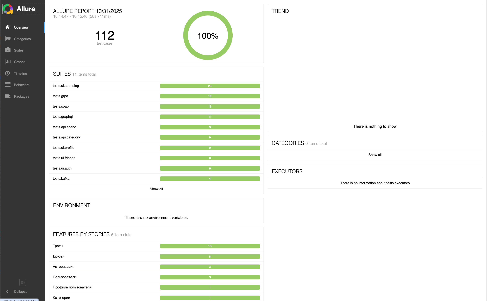
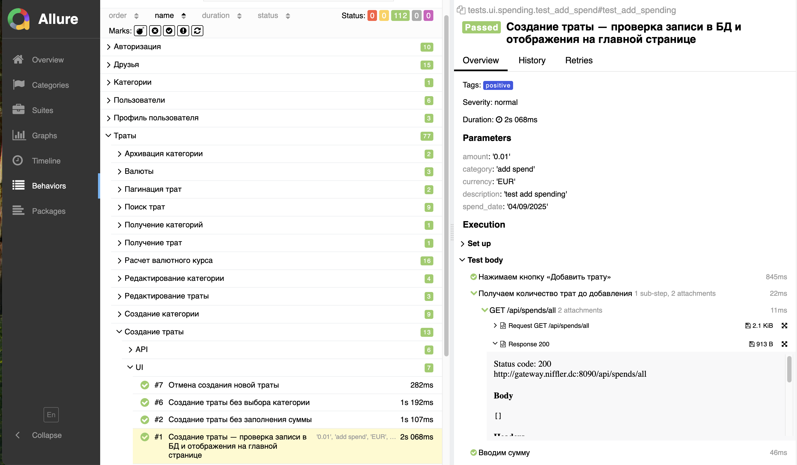

## 🪙 Niffler Autotests (Python Advanced)

Проект создан в рамках курса
**«Автоматизация тестирования для продвинутых инженеров (Python Advanced)»**

https://qa.guru/python-advanced

Проект обеспечивает автоматизированное тестирование микросервисного приложения Niffler (кошелёк), включающего **UI, API (REST, SOAP, GraphQL, gRPC)** и **Kafka** взаимодействия.
Тесты запускаются локально и в **Docker-среде**, автоматически формируется **Allure-отчёт**, а непрерывная интеграция реализована через **GitHub Actions**.

### 🧩 Использованные технологии
Проект реализован на Python с использованием следующих библиотек и инструментов:
#### Основной стек
- **Pytest** — фреймворк для написания и запуска автотестов.
- **Playwright** — фреймворк для UI-тестов с поддержкой параллельного запуска и разных браузеров.
- **SQLAlchemy** и **SQLModel** — ORM и модели данных для работы с PostgreSQL.
- **Pydantic** — валидация данных.
- **Requests** — взаимодействие с REST API.
- **Confluent-Kafka** — взаимодействие с Kafka для тестов обмена сообщениями.
- **Jinja2** — шаблонизация данных и payload’ов запросов.
- **pbreflect** — работа с protobuf-сообщениями.
- **xmlschema** — проверка XML-схем.
#### Инструменты для разработки и тестирования
- **Allure Pytest** — формирование детальных отчётов о прохождении тестов.
- **pytest-xdist** — параллельный запуск тестов.

### 🧪 Типы реализованных тестов
| Тип тестов       | Описание                                                                                                                                                                            |
|------------------|-------------------------------------------------------------------------------------------------------------------------------------------------------------------------------------|
| **REST API тесты** | Проверка CRUD-операций микросервиса *niffler-spend*.                                                                                                                                |
| **GraphQL тесты** | Проверка корректности рассчета статистики, редактирование профиля пользователя через GraphQL API.                                                                                   |
| **gRPC тесты**   | Проверка методов *CalculateRate* и *GetAllCurrencies* сервиса *NifflerCurrencyService*.                                                                                             |
| **Kafka тесты**  | Проверка публикации и считывания сообщений после регистрации пользователей.                                                                                                         |
| **SOAP тесты**   | Проверка SOAP-методов микросервиса *niffler-userdata* (получение списков пользователей, друзей, управление запросами на дружбу).                                                    |
| **UI тесты**     | Проверка основных пользовательских сценариев Web SPA Niffler (регистрация, логин, создание, редактирование и удаление трат и категорий, просмотр пользователей, добавление друзей). |

## 🛠 Установка проекта
1. Склонировать проект с приложением Niffler и тестами
```bash
    git clone https://github.com/avdarya/niffler-py-st3.git
```
2. Перейти в корневой каталог монорепозитория
```bash
    cd niffler-py-st3-avdarya
```
3. Запустить микросервисы
```bash
    bash docker-compose-dev.sh
```
4. Перейти в папку с тестами
```bash
    cd niffler_tests_python 
```
5. Добавить файлы .env, docker.env (см файлы .env_sample, docker.env_sample).
```bash
   cp .env_sample .env
   cp docker.env_sample docker.env
```
6. Подготовить окружение
- macOS / Linux
```bash
    poetry install
    source $(poetry env info --path)/bin/activate
```
- Windows PowerShell
```bash
    poetry install
    . "$(poetry env info --path)\Scripts\Activate.ps1"
```

### ⚙️ Локальный запуск тестов

<details>
<summary>🌐 Настройка локальных alias-доменов для локально запускаемых тестов</summary>
Для корректного запуска тестов добавьте следующие записи в системный файл `hosts`.

### 🧩 macOS / Linux
1.	Откройте файл /etc/hosts с правами администратора:
```bash
    sudo nano /etc/hosts
```
2.	Добавьте в конец файла следующие строки:
```bash
    127.0.0.1       frontend.niffler.dc
    127.0.0.1       auth.niffler.dc
    127.0.0.1       gateway.niffler.dc
    127.0.0.1       kafka 
```
3.	Нажмите Ctrl + O → Enter → Ctrl + X, чтобы сохранить изменения и выйти. 
### 🪟 Windows
1.	Откройте Блокнот от имени администратора.
2.	Откройте файл:
```bash
    C:\Windows\System32\drivers\etc\hosts
```
3. Добавьте в конец файла следующие строки:
```bash
    127.0.0.1       frontend.niffler.dc
    127.0.0.1       auth.niffler.dc
    127.0.0.1       gateway.niffler.dc
    127.0.0.1       kafka 
```
4.	Сохраните файл и перезапустите терминал / IDE.

После этого:
- фронтенд будет доступен по адресу: http://frontend.niffler.dc
- сервис авторизации — http://auth.niffler.dc
- API-шлюз — http://gateway.niffler.dc
- Kafka — будет резолвиться как kafka для тестов и docker-контейнеров
</details>

🧪 Запуск тестов
```bash
    pytest
```
🌐 UI-тесты в браузере Chrome (по умолчанию). Режим отображения браузера (headless / headed)
управляется переменной HEADED в файле .env.
```bash
    pytest --browser=chromium tests/ui
```
🌐 UI-тесты в Firefox
```bash
    pytest --browser=firefox tests/ui
```
⚡ Параллельный запуск
```bash
    bash run_parallel_tests.sh
```
📊 Просмотр Allure-отчёта
```bash
    allure serve allure-results
```
<details>
<summary>Пример allure-отчета</summary>


</details>

### 🐳 Запуск тестов в Docker-контейнере
1. Собрать образ с тестами (выполняется из корня монорепозитория)
```bash
    docker build -t qaguru/niffler-py-tests:latest -f ./niffler_tests_python/Dockerfile . 
```
2. Запустить контейнер с тестами
```bash
    cd niffler_tests_python
```
```bash
    docker run --rm \
    --env-file docker.env \
    --network niffler-py-st3-avdarya_niffler-network \
    qaguru/niffler-py-tests:latest  
```
- Примеры запуска UI тестов в контейнере
```bash
    docker run --rm \
    --env-file docker.env \
    --network niffler-py-st3-avdarya_niffler-network \
    qaguru/niffler-py-tests:latest --browser=chromium tests/ui
```
```bash
    docker run --rm \
    --env-file docker.env \
    --network niffler-py-st3-avdarya_niffler-network \
    qaguru/niffler-py-tests:latest --browser=firefox tests/ui
```
- Запуск параллельных тестов:
```bash
    docker run --rm \
    --env-file docker.env \
    --network niffler-py-st3-avdarya_niffler-network \
    --entrypoint /bin/sh \
    qaguru/niffler-py-tests:latest \
    -c "pytest -m isolated && pytest -m 'not isolated' -n auto"
```

### 🚀 Запуск тестов в GitHub Actions
Тесты запускаются автоматически при каждом push или pull request.

### 🌐 Запуск тестов на отдельно развернутый gRPC-сервер
1. В отдельном терминале запустить mock-сервис валют (currencymock), используемый для тестирования gRPC-запросов.
```bash
    cd niffler-py-st3-avdarya
```
```bash
    docker compose -f docker-compose.grpcmock.yml up
```
2. Запустить тесты
```bash
   cd niffler_tests_python
```
```bash
   pytest tests/grpc --grpc-mock
```